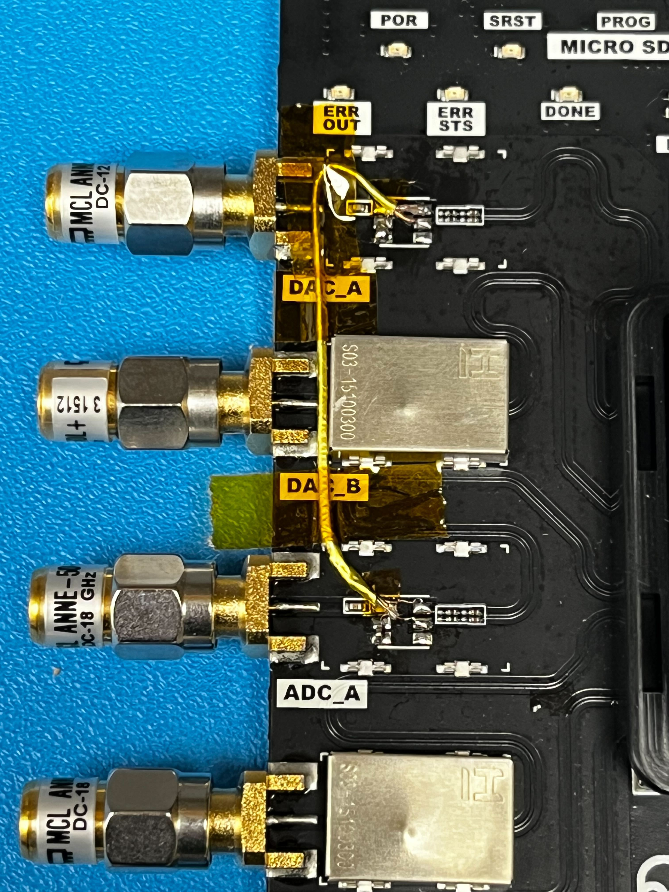

# rfsoc-4x2-photon-detector-dev

This project is an example of emulating the SiPM signal using a RFSOC DAC and reading it back from the RFSoC ADC.
The DAC[A] output is loopbacked to the ADC[A].
The DAC is operating at 8 GSample/s, and the ADC is operating at 2 GSample/s.

Only ADC[A] and DAC[A] is implemented in the firmware.  ADC[B,C,D] and DAC[B] are unused.

Here's the URL to the RFSoC 4x2 hardware:
http://dev.realdigital.org/hardware/rfsoc-4x2

Due to the 10MHz low frequency roll off of the balums on the RFSoC 4x2, we removed them
and installed a differential twinax cable for the loopback to decrease the low frequnecy 
cutoff as low as reasonably possible. 



<!--- ######################################################## -->

# Before you clone the GIT repository

https://confluence.slac.stanford.edu/x/vJmDFg

<!--- ######################################################## -->

# Clone the GIT repository

```bash
$ git clone --recursive git@github.com:slaclab/rfsoc-4x2-photon-detector-dev
```

<!--- ######################################################## -->

# How to generate the RFSoC .BIT and .XSA files

1) Setup Xilinx PATH and licensing (if on SLAC AFS network) else requires Vivado install and licensing on your local machine

```bash
$ source rfsoc-4x2-photon-detector-dev/firmware/setup_env_slac.sh
```

2) Go to the target directory and make the firmware:

```bash
$ cd rfsoc-4x2-photon-detector-dev/firmware/targets/Rfsoc4x2PhotonDetectorDev/
$ make
```

3) Optional: Review the results in GUI mode

```bash
$ make gui
```

The .bit and .XSA files are dumped into the Rfsoc4x2PhotonDetectorDev/image directory:

```bash
$ ls -lath ../Rfsoc4x2PhotonDetectorDev/images/
total 36M
drwxr-xr-x 2 ruckman re 2.0K Apr 25 12:47 .
-rw-r--r-- 1 ruckman re 2.7M Apr 25 12:47 Rfsoc4x2PhotonDetectorDev-0x01000000-20230425123732-ruckman-b869419.xsa
-rw-r--r-- 1 ruckman re  33M Apr 25 12:47 Rfsoc4x2PhotonDetectorDev-0x01000000-20230425123732-ruckman-b869419.bit
drwxr-xr-x 5 ruckman re 2.0K Apr 25 12:47 ..
```

<!--- ######################################################## -->

# How to build Petalinux images

1) Generate the .bit and .xsa files (refer to `How to generate the RFSoC .BIT and .XSA files` instructions).

2) Setup Xilinx licensing and petalinux software (if on SLAC AFS network) else requires Xilinx & petalinux install on your local machine

```bash
$ source rfsoc-4x2-photon-detector-dev/firmware/setup_env_slac.sh
$ source /path/to/petalinux/2022.2/settings.sh
```

3) Go to the target directory and run the `CreatePetalinuxProject.sh` script with arg pointing to path of .XSA file:

```bash
$ cd rfsoc-4x2-photon-detector-dev/firmware/targets/Rfsoc4x2PhotonDetectorDev/
$ source CreatePetalinuxProject.sh images/Rfsoc4x2PhotonDetectorDev-0x01000000-20230425123732-ruckman-b869419.xsa
```

<!--- ######################################################## -->

# How to make the SD memory card for the first time

1) Creating Two Partitions.  Refer to URL below

https://xilinx-wiki.atlassian.net/wiki/x/EYMfAQ

2) Copy For the boot images, simply copy the files to the FAT partition.
This typically will include system.bit, BOOT.BIN, image.ub, and boot.scr.  Here's an example:

Note: Assumes SD memory FAT32 is `/dev/sde1` in instructions below

```bash
sudo mkdir -p boot
sudo mount /dev/sde1 boot
sudo cp rfsoc-4x2-photon-detector-dev/firmware/build/petalinux/Rfsoc4x2PhotonDetectorDev/images/linux/system.bit boot/.
sudo cp rfsoc-4x2-photon-detector-dev/firmware/build/petalinux/Rfsoc4x2PhotonDetectorDev/images/linux/BOOT.BIN   boot/.
sudo cp rfsoc-4x2-photon-detector-dev/firmware/build/petalinux/Rfsoc4x2PhotonDetectorDev/images/linux/image.ub   boot/.
sudo cp rfsoc-4x2-photon-detector-dev/firmware/build/petalinux/Rfsoc4x2PhotonDetectorDev/images/linux/boot.scr   boot/.
sudo sync boot/
sudo umount boot
```

3) Power down the RFSoC board and plug in the SD memory card

4) Power up the RFSoC board

5) Confirm that you can ping the boot after it boots up

<!--- ######################################################## -->

# How to remote update the firmware bitstream

- Assumes the DHCP assigned IP address is 10.0.0.10

1) Using "scp" to copy your .bit file to the SD memory card on the RFSoC.  Here's an example:

```bash
ssh-keygen -f "$HOME/.ssh/known_hosts" -R "10.0.0.10" # https://jira.slac.stanford.edu/browse/ESRFOC-54
scp Rfsoc4x2PhotonDetectorDev-0x01000000-20220204204648-ruckman-90df89c.bit root@10.0.0.10:/media/boot/system.bit
```

2) Send a "sync" and "reboot" command to the RFSoC to load new firmware:  Here's an example:

```bash
ssh root@10.0.0.10 '/bin/sync; /sbin/reboot'
```

<!--- ######################################################## -->

# How to install the Rogue With Anaconda

> https://slaclab.github.io/rogue/installing/anaconda.html

<!--- ######################################################## -->

# How to run the Rogue GUI

- Assumes the DHCP assigned IP address is 10.0.0.10

1) Setup the rogue environment (if on SLAC AFS network) else install rogue (recommend Anaconda method) on your local machine

```bash
$ source rfsoc-4x2-photon-detector-dev/software/setup_env_slac.sh
```

2) Go to software directory and lauch the GUI:

```bash
$ cd rfsoc-4x2-photon-detector-dev/software
$ python scripts/devGui.py --ip 10.0.0.10
```

<!--- ######################################################## -->
